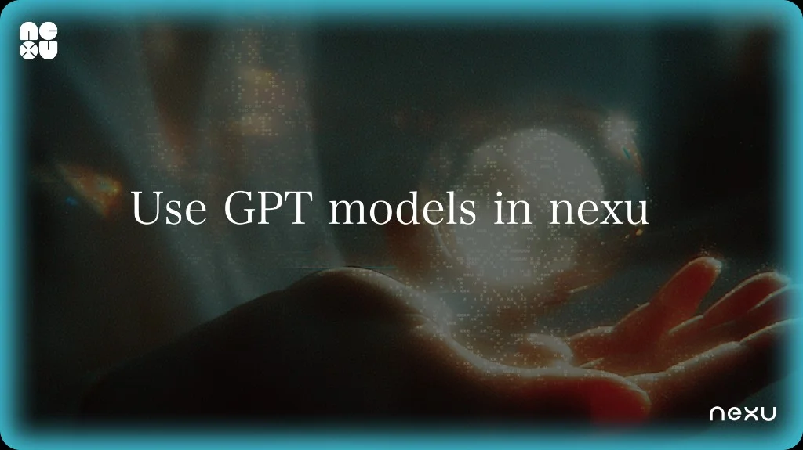
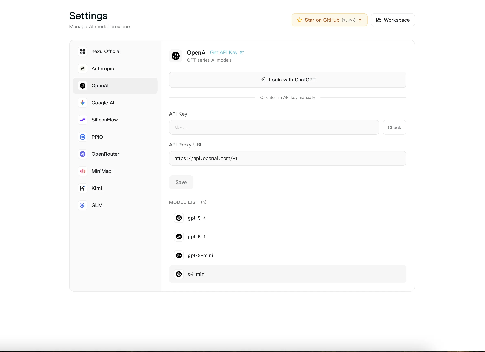

# Use GPT Models in nexu with Your ChatGPT Subscription — No API Key Needed

> If you already pay for ChatGPT Plus or Pro, you can now connect GPT models to nexu through your existing OpenAI account. No separate API key, no billing setup, no developer console.

## What Changed

nexu, the simplest open-source OpenClaw desktop client, adds **OpenAI Codex OAuth** in v0.1.7 — a one-click sign-in flow that connects your ChatGPT subscription directly to nexu. Once you sign in, GPT-4o and other OpenAI models appear in your model selector immediately.

Before this, using GPT models in nexu required generating an API key from the OpenAI developer platform, entering it manually, and managing a separate pay-as-you-go billing account. Most ChatGPT Plus and Pro subscribers never touch the developer platform — they just want to use the models they already pay for.

Now you can.

## Who This Is For

**ChatGPT Plus subscribers** ($20/month) — you're already paying for GPT-4o access. Now that same subscription works inside nexu, across WeChat, Feishu, Slack, and Discord.

**ChatGPT Pro subscribers** ($200/month) — you get higher rate limits and priority access. Those benefits carry over when you connect via OAuth.

**Anyone who tried BYOK and gave up** — if you found the API key setup confusing or didn't want a second OpenAI bill, OAuth removes both friction points.

## How to Connect

1. Open nexu and go to **Settings → Providers**.
2. Find **OpenAI Codex** in the provider list.
3. Click **"Sign in with ChatGPT"**.
4. Authorize nexu in the OpenAI login window.
5. Done — GPT models appear in your model selector.

No API key to copy. No billing to configure. The connection persists across app restarts.

## What You Get

- GPT-4o and other models available in your ChatGPT plan
- Works across all connected IM channels (WeChat, Feishu, Slack, Discord)
- Can be used alongside BYOK providers — mix and match models from different sources
- Disconnect anytime from Settings → Providers → OpenAI Codex → "Disconnect"

## What It Doesn't Do

- Does not give access to models outside your ChatGPT plan tier
- Does not bypass OpenAI's usage limits — your subscription's rate limits still apply
- Does not replace BYOK if you need fine-tuned models or custom API endpoints

## Get Started

Download [nexu v0.1.7](https://github.com/nexu-io/nexu/releases/tag/v0.1.7) or update in-app. Available for macOS (Apple Silicon). Windows and Intel Mac support is in development.

Source: [GitHub Releases — nexu v0.1.7](https://github.com/nexu-io/nexu/releases/tag/v0.1.7)
