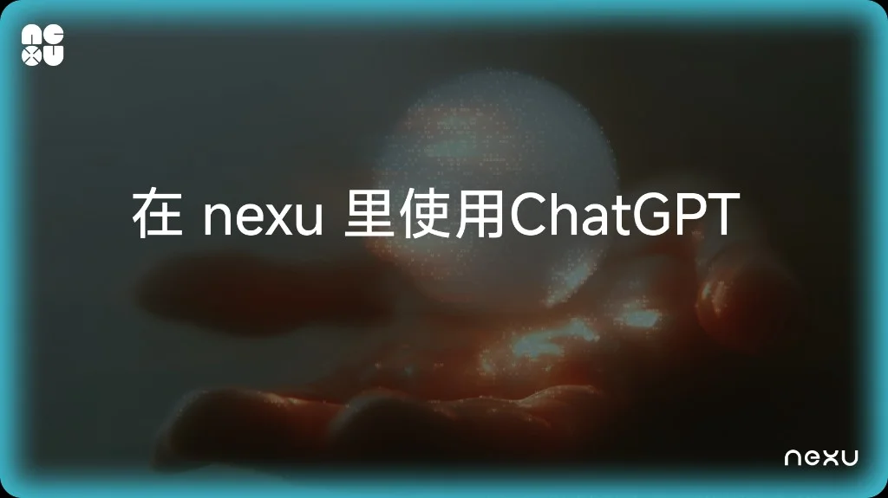
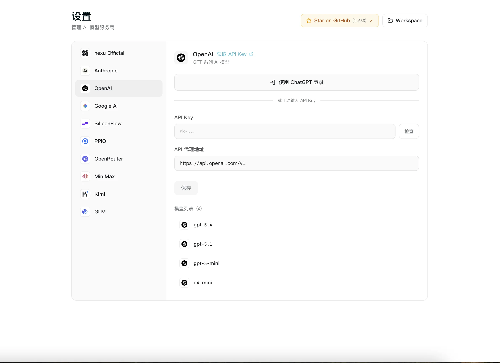

# 用你的 ChatGPT 订阅在 nexu 里直接使用 GPT 模型——无需 API Key

> 如果你已经在付费使用 ChatGPT Plus 或 Pro，现在可以直接用 OpenAI 账号登录 nexu，一键接入 GPT 模型。不用申请 API Key，不用配置计费，不用进开发者后台。

## 有什么变化

nexu——最简单的开源龙虾桌面客户端——在 v0.1.7 中新增 **OpenAI Codex OAuth**，一键登录流程，把你的 ChatGPT 订阅直接连接到 nexu。登录后，GPT-4o 等 OpenAI 模型会立刻出现在模型选择器中。

之前要在 nexu 里用 GPT 模型，需要去 OpenAI 开发者平台生成 API Key、手动填入、还要单独管理按量计费账户。大多数 ChatGPT Plus 和 Pro 用户从来不碰开发者平台——他们只想用自己已经付费的模型。

现在可以了。

## 适合谁

**ChatGPT Plus 订阅用户**（$20/月）——你已经在为 GPT-4o 付费。现在同一个订阅可以在 nexu 里使用，覆盖微信、飞书、Slack、Discord 所有渠道。

**ChatGPT Pro 订阅用户**（$200/月）——你享有更高的速率限制和优先访问权。通过 OAuth 连接后，这些权益同样生效。

**试过 BYOK 但放弃了的人**——如果你觉得 API Key 配置太麻烦，或者不想多一份 OpenAI 账单，OAuth 一次性解决了这两个问题。

## 如何连接

1. 打开 nexu，进入 **Settings → Providers**。
2. 找到 **OpenAI Codex**。
3. 点击 **"Sign in with ChatGPT"**。
4. 在 OpenAI 登录窗口中授权 nexu。
5. 完成——GPT 模型已出现在模型选择器中。

不用复制 API Key，不用配置计费。连接在应用重启后持续有效。

## 你会得到什么

- ChatGPT 订阅方案内的 GPT-4o 等模型
- 在所有已连接的 IM 渠道中可用（微信、飞书、Slack、Discord）
- 可以和 BYOK 供应商并存——来自不同来源的模型混合使用
- 随时可从 Settings → Providers → OpenAI Codex → "Disconnect" 断开连接

## 不包含什么

- 不会解锁你的 ChatGPT 方案以外的模型
- 不会绕过 OpenAI 的使用限制——订阅的速率限制依然适用
- 不替代 BYOK（如果你需要微调模型或自定义 API 端点）

## 开始使用

下载 [nexu v0.1.7](https://github.com/nexu-io/nexu/releases/tag/v0.1.7) 或在应用内检查更新。支持 macOS（Apple Silicon）。Windows 和 Intel Mac 支持正在开发中。

来源：[GitHub Releases — nexu v0.1.7](https://github.com/nexu-io/nexu/releases/tag/v0.1.7)
