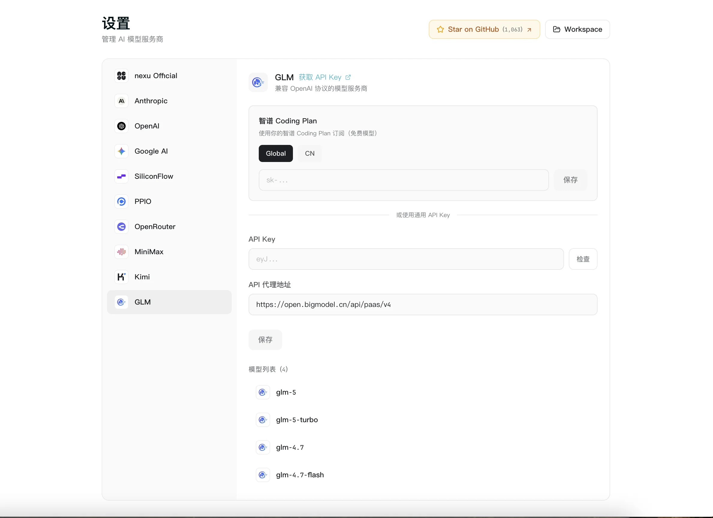

# nexu 新增 Z.AI Coding Plan——GLM 模型接入，Global/CN 双区切换

> 在 nexu 中快速接入智谱 Z.AI 的 GLM 模型。选择 Global 或 CN 区域，填入 API Key，GLM 模型即可在所有 IM 渠道中使用。

## 有什么变化

nexu——最简单的开源龙虾桌面客户端——在 v0.1.7 中新增 **Z.AI Coding Plan** 供应商选项，简化的智谱 GLM 模型接入流程。核心亮点是 **Global/CN 区域切换**，根据你的位置选择 API 端点，无论在中国大陆还是海外，延迟都保持在最低水平。

## 适合谁

**使用智谱 GLM 模型的开发者**——如果 GLM 是你做中文推理、代码生成或对话 AI 的主力模型，现在可以接入 nexu，部署到微信、飞书、Slack、Discord 各渠道。

**需要按区域选择端点的团队**——Global/CN 切换意味着你不用手动配置 API 基础 URL。选择区域后 nexu 自动将请求路由到正确的端点。

**跨语言团队**——如果你的工作流横跨中国和国际市场，可以在同一个 nexu 实例中用 Z.AI 处理中文任务，用 OpenAI 或其他供应商处理英文任务。

## 如何配置

1. 打开 nexu，进入 **Settings → Providers**。
2. 找到 **Z.AI Coding Plan**。
3. 选择区域：**Global** 或 **CN**。
4. 输入你的 Z.AI API Key。
5. 完成——GLM 模型已出现在模型选择器中。

## 你会得到什么

- GLM 模型在所有已连接的 IM 渠道中可用（微信、飞书、Slack、Discord）
- 区域切换：Global（海外用户）或 CN（中国大陆）——更低延迟，无需手动配置 URL
- 可以和其他供应商（OpenAI OAuth、MiniMax OAuth、BYOK）同时使用
- 随时可从 Settings → Providers → Z.AI 切换区域

## 不包含什么

- 不支持 OAuth 登录——Z.AI 需要 API Key（从 [open.bigmodel.cn](https://open.bigmodel.cn) 获取）
- 不提供免费 Z.AI 用量——适用你的 Z.AI 账户方案和计费

## 开始使用

下载 [nexu v0.1.7](https://github.com/nexu-io/nexu/releases/tag/v0.1.7) 或在应用内检查更新。支持 macOS（Apple Silicon）。Windows 和 Intel Mac 支持正在开发中。

来源：[GitHub Releases — nexu v0.1.7](https://github.com/nexu-io/nexu/releases/tag/v0.1.7)
