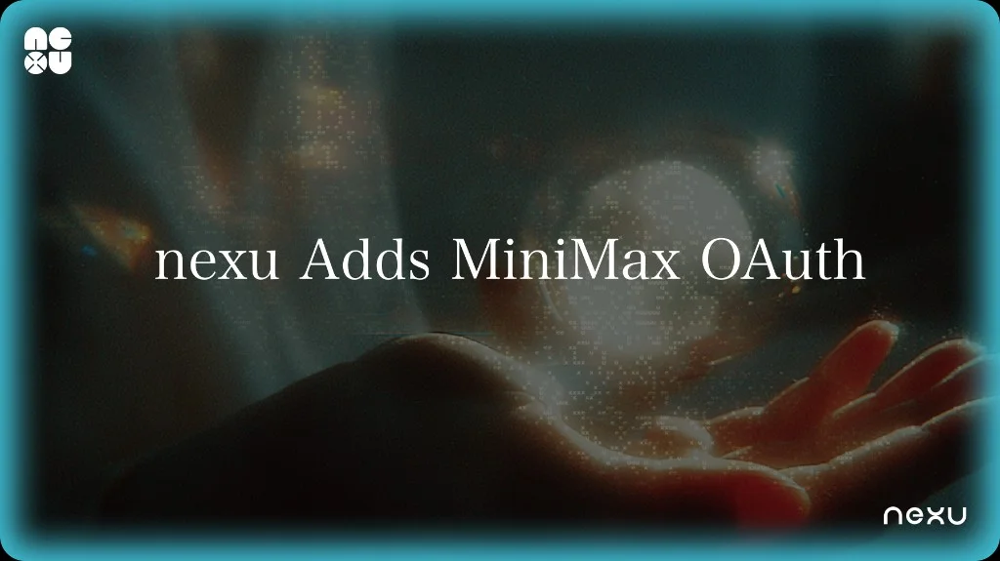

# nexu Now Supports MiniMax OAuth — Connect in One Click

> One-click MiniMax model access in nexu. No API key, no manual configuration — sign in with your MiniMax account and start using MiniMax models across all your IM channels.

## What Changed

nexu, the simplest open-source OpenClaw desktop client, adds **MiniMax OAuth** in v0.1.7 — sign in with your MiniMax account and models appear in your selector immediately.

Before this, connecting MiniMax models required obtaining an API key from the MiniMax developer platform, copying it into nexu's settings, and troubleshooting formatting issues. OAuth eliminates all of that.

## Who This Is For

**MiniMax users in China** — if you use MiniMax models for Chinese-language tasks (content generation, customer support, translation), you can now bring those models into nexu and deploy them across WeChat and Feishu without managing API keys.

**Teams evaluating domestic AI providers** — MiniMax OAuth gives you zero-config access to test MiniMax models side by side with OpenAI, Z.AI, and other providers in the same nexu instance.

## How to Connect

1. Open nexu and go to **Settings → Providers**.
2. Find **MiniMax** in the provider list.
3. Click **"Sign in with MiniMax"**.
4. Authorize nexu in the MiniMax login window.
5. Done — MiniMax models appear in your model selector.

## What You Get

- MiniMax models available across all connected IM channels (WeChat, Feishu, Slack, Discord)
- Redesigned provider UI: connection status, available models, and disconnect option at a glance
- Works alongside OpenAI OAuth, Z.AI, and BYOK providers without conflicts
- Disconnect anytime from Settings → Providers → MiniMax → "Disconnect"

## What It Doesn't Do

- Does not provide free MiniMax usage — your MiniMax account's plan and limits apply
- Does not include MiniMax-specific skills — standard OpenClaw skills work with any model

## Get Started

Download [nexu v0.1.7](https://github.com/nexu-io/nexu/releases/tag/v0.1.7) or update in-app. Available for macOS (Apple Silicon). Windows and Intel Mac support is in development.

Source: [GitHub Releases — nexu v0.1.7](https://github.com/nexu-io/nexu/releases/tag/v0.1.7)
