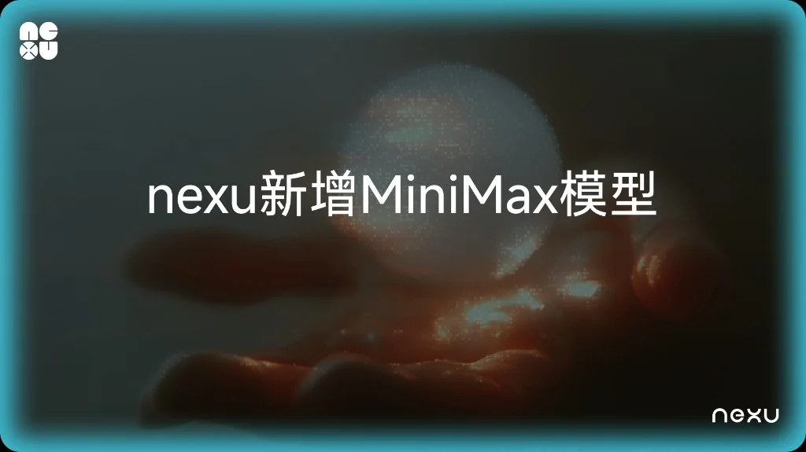

# nexu 新增 MiniMax OAuth：一键接入，降低使用成本

> nexu v0.1.7 支持通过 MiniMax OAuth 直接登录，无需 API Key 即可调用 MiniMax 全系列模型，同时复用账户已有额度，有效降低接入和使用成本。

## 背景

要在 nexu 里使用 MiniMax，之前的路径是：在 MiniMax 开放平台创建应用、复制 API Key，再粘贴到 nexu 的 Provider 设置里。若遇到鉴权、端点或配额问题，往往需要自行查文档、反复调试——对非技术用户不够友好，也会增加团队的支持与 onboarding 成本。

与此同时，不少团队已经在 MiniMax 侧购买了订阅类套餐（例如面向开发场景的 Token Plan 等，具体以官方说明为准）：这类方案通常按固定周期费用 + 明确配额/用量规则计费，便于做预算。

在 OAuth 之前，若要在第三方工具里用模型，往往仍要再走独立的 API Key + 按量路径——容易出现「账户里明明有套餐，却在工具侧按 token 另扣一笔」的割裂感，也不利于把试用与正式投入放在同一套计费逻辑里评估。

## 解决方案

v0.1.7 引入了 **MiniMax OAuth 登录**，从两个层面改善了上述问题：

**接入更简单。** 用户无需申请 API Key，直接使用 MiniMax 账号授权登录 nexu，模型即刻可用。全流程在 1 分钟内完成，无需访问开发者后台。

**成本更可控。** OAuth 接入后，模型调用直接走用户 MiniMax 账户已有的额度和套餐方案：

- 已有付费方案的用户，在 nexu 中使用不会产生额外费用
- 尚未购买方案的用户，也可直接使用 MiniMax 提供的免费额度进行测试
- 相比通过独立 API Key 按量计费，整体使用成本更透明、更可控

## 适用场景

**MiniMax 用户** — 如果你已在使用 MiniMax 模型处理内容生成、客户支持、翻译等中文场景任务，现在可以将模型直接接入 nexu，部署到微信、飞书等 IM 渠道，省去独立的 Key 管理和额外的 API 计费。

**多模型供应商并行使用的团队** — nexu 支持 MiniMax、OpenAI、Z.AI 等供应商同时接入，模型之间可随时切换，不存在配置冲突。便于在同一环境中对比不同模型的表现，按需选择最优方案。

## 接入步骤

1. 打开 nexu，进入 **Settings → Providers**
2. 在列表中找到 **MiniMax**
3. 点击 **"Sign in with MiniMax"**
4. 在弹出页面中完成 MiniMax 账号授权
5. 返回 nexu，MiniMax 模型已出现在模型选择器中

## 接入后的能力

- MiniMax 模型可在所有已连接的 IM 渠道中使用，包括微信、飞书、Slack 和 Discord
- Provider UI 统一展示连接状态、可用模型列表及断开入口
- 与 OpenAI OAuth、Z.AI、BYOK 等其他供应商并行运行，互不干扰
- 支持随时从 Settings → Providers → MiniMax 断开连接

## 注意事项

- 模型用量消耗 MiniMax 账户自身的额度和套餐，nexu 不额外收费
- 暂无 MiniMax 专属 Skills，标准 OpenClaw Skills 适用于所有模型

## 开始使用

下载 [nexu v0.1.7](https://github.com/nexu-io/nexu/releases/tag/v0.1.7) 或在应用内检查更新。当前支持 macOS（Apple Silicon），Windows 和 Intel Mac 版本即将推出。
