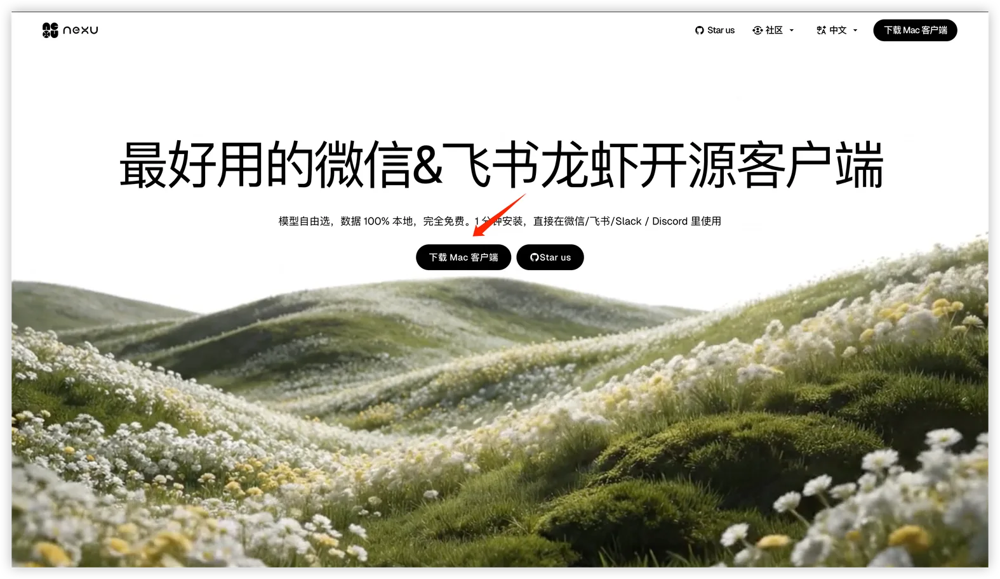
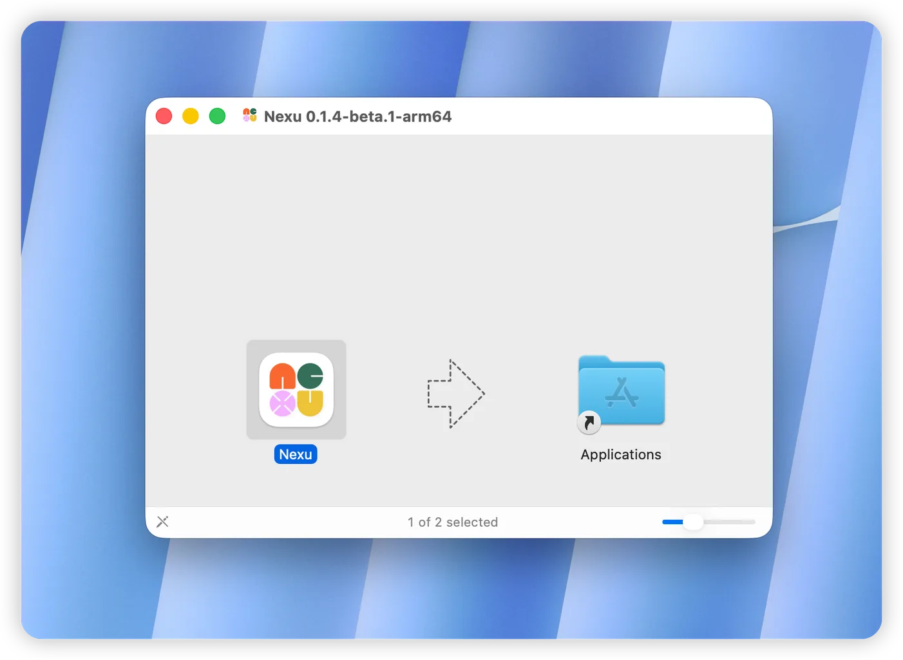
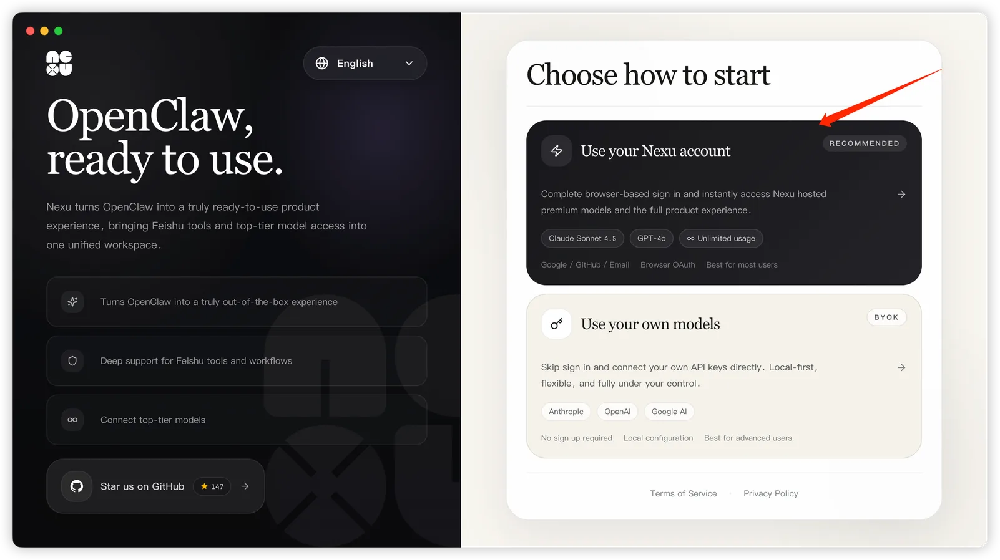
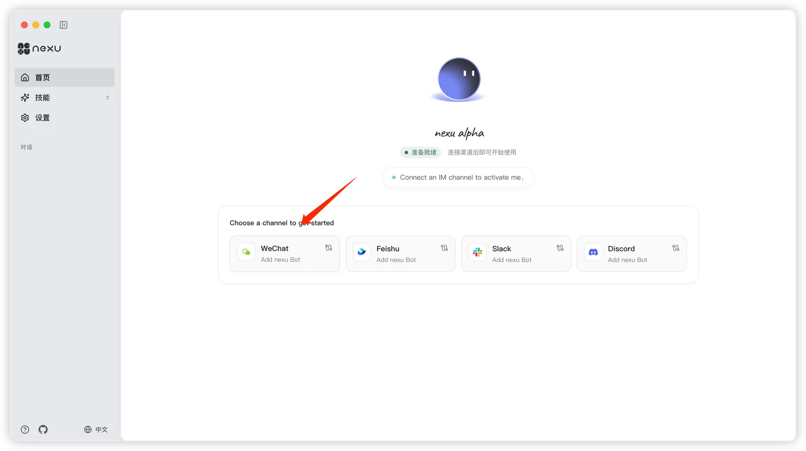
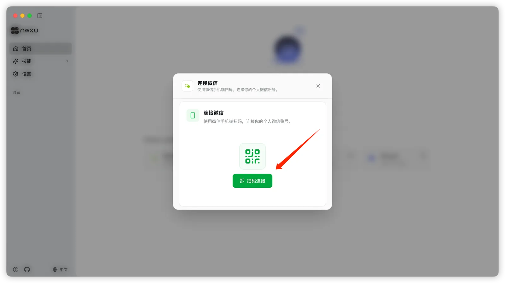
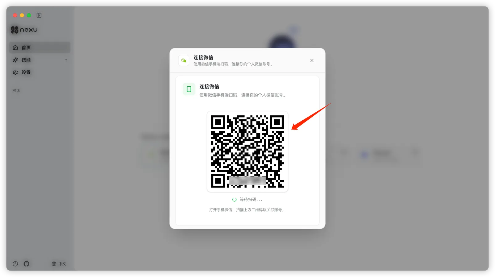
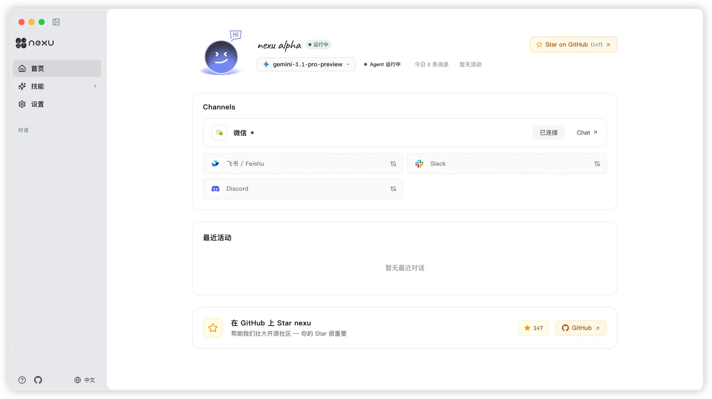
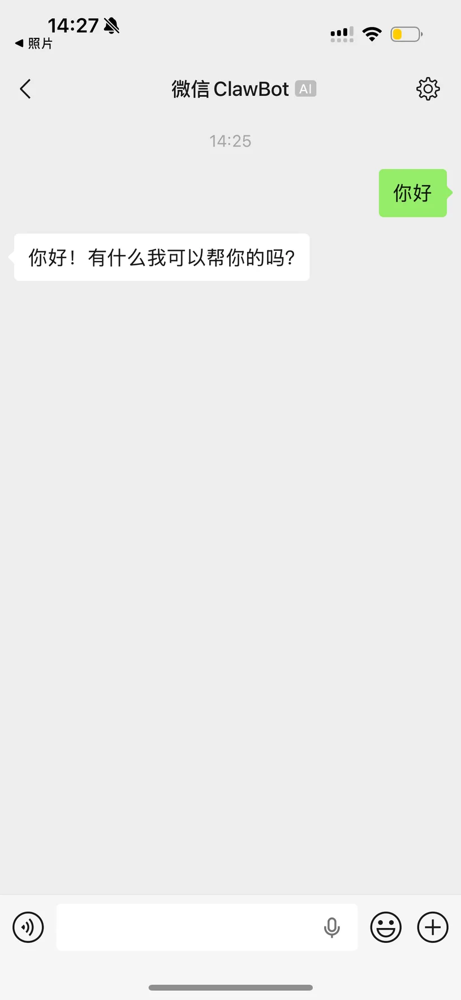

# Channel Setup: Connect Your AI Agent to WeChat in 5 Minutes

> Scan one QR code — that's it. Use nexu's ClawBot plugin to run your AI agent directly in personal WeChat, no API keys or servers needed.

With nexu, connecting your AI agent to personal WeChat takes one QR code scan and under 5 minutes. No public server, no API keys, no WeChat developer account.

## Prerequisites

WeChat version ≥ 8.0.7 (minimum version supporting the ClawBot plugin). macOS 12+ (Apple Silicon).

## Step 1: Update WeChat to 8.0.7

Open WeChat and update to version 8.0.7 or higher. This is the minimum version that supports the ClawBot plugin.

## Step 2: Download and Install nexu

Go to [nexu.io](https://nexu.io/) and click "Download Mac Client".

Open the .dmg file and drag the nexu icon into your Applications folder.

## Step 3: Launch nexu and Log In

On the welcome screen, choose your login method. "Use your Nexu account" (recommended) gives you free access to Claude, GPT, Gemini and more — no API key needed. "Use your own models (BYOK)" lets you bring your own API keys without creating an account.

## Step 4: Select WeChat Channel

After logging in, on the nexu home screen, click "WeChat" in the "Choose a channel to get started" area.

## Step 5: Scan the QR Code

In the "Connect WeChat" dialog, click the green "Scan to Connect" button.

nexu automatically installs the WeChat ClawBot plugin and generates a QR code. The screen shows "Waiting for scan...".

Open WeChat on your phone, use the built-in scanner, scan the QR code, and confirm the connection on your phone.

## Step 6: Connection Successful

After confirming, the WeChat channel on nexu's home screen shows "Connected" status.

## Step 7: Chat in WeChat

Open WeChat — you'll see a conversation called "WeChat ClawBot". Send it a message and your OpenClaw Agent will reply directly in the chat. Available on your phone anytime, anywhere.

## FAQ

**Do I need a public server?** No. nexu connects through the ClawBot plugin directly — no public IP or callback URLs needed.

**Do I need an enterprise WeChat or official account?** No. WeChat 8.0.7 natively supports ClawBot — personal WeChat is all you need.

**Will my account get banned?** No. ClawBot is an official WeChat plugin, fully compliant.

**What if my computer sleeps?** Keep nexu running in the background with your Mac awake, and your agent responds 24/7.

**Can I connect other channels too?** Yes. nexu supports WeChat, [Feishu](#how-to-deploy-feishu-ai-bot), [Slack](#how-to-setup-slack-ai-agent), and [Discord](#how-to-add-discord-ai-bot) simultaneously.

---

# 渠道配置：5 分钟把 AI Agent 接入微信

> 扫一次码就搞定。用 nexu 的 ClawBot 插件，在个人微信里直接运行 AI Agent，不需要 API Key，不需要服务器。

通过 nexu 客户端，只需扫一次码，即可将微信 OpenClaw 🦞 ClawBot 接入你的个人微信——全程不到 5 分钟。

## 前置条件

微信版本 ≥ 8.0.7（支持 ClawBot 插件的最低版本）。macOS 12+（Apple Silicon）。

## 第一步：更新微信至 8.0.7

在微信中将版本更新到 8.0.7 或更高版本。这是支持 ClawBot 插件的最低版本。

## 第二步：下载并安装 nexu

打开 [nexu 官网](https://nexu.io/)，点击「下载 Mac 客户端」。

下载完成后，打开 .dmg 文件，将 Nexu 图标拖入 Applications 文件夹。

## 第三步：启动 nexu 并登录

在欢迎页面选择登录方式：Use your Nexu account（推荐）——使用 nexu 账号登录，即可免费使用 Claude、GPT、Gemini 等顶级模型。Use your own models (BYOK)——填入自己的 API Key，无需注册。

## 第四步：选择微信渠道

登录后进入 nexu 首页，在「Choose a channel to get started」区域中点击 WeChat。

## 第五步：扫码连接微信

弹出「连接微信」对话框后，点击绿色的「扫码连接」按钮。

nexu 会自动安装微信 ClawBot 插件并生成二维码，页面显示「等待扫码...」。

打开手机上的微信，使用「扫一扫」扫描屏幕上的二维码，然后在手机上点击确认连接。

## 第六步：连接成功

扫码确认后，nexu 首页的微信渠道会显示已连接状态。

## 第七步：在微信中对话

打开微信，你会看到一个名为「微信 ClawBot」的对话。直接发消息就能和你的 OpenClaw Agent 聊天——手机上随时随地可用，不受桌面限制。

## 常见问题

**需要公网服务器吗？**不需要。nexu 通过微信 ClawBot 插件直连，无需公网 IP 或回调地址。

**需要企业微信或公众号吗？**不需要。微信 8.0.7 原生支持 ClawBot 插件，个人微信即可使用。

**会不会被封号？**不会。ClawBot 是微信官方推出的插件，完全合规。

**手机和电脑都关了，Agent 还能回复吗？**需要保持 nexu 客户端运行。只要 nexu 在后台运行（电脑不休眠），Agent 就能 7×24 小时在线回复微信消息。

**可以同时接入多个渠道吗？**可以。nexu 支持同时连接[微信](#how-to-connect-wechat-ai-agent)、[飞书](#how-to-deploy-feishu-ai-bot)、[Slack](#how-to-setup-slack-ai-agent)、[Discord](#how-to-add-discord-ai-bot) 等多个渠道。

