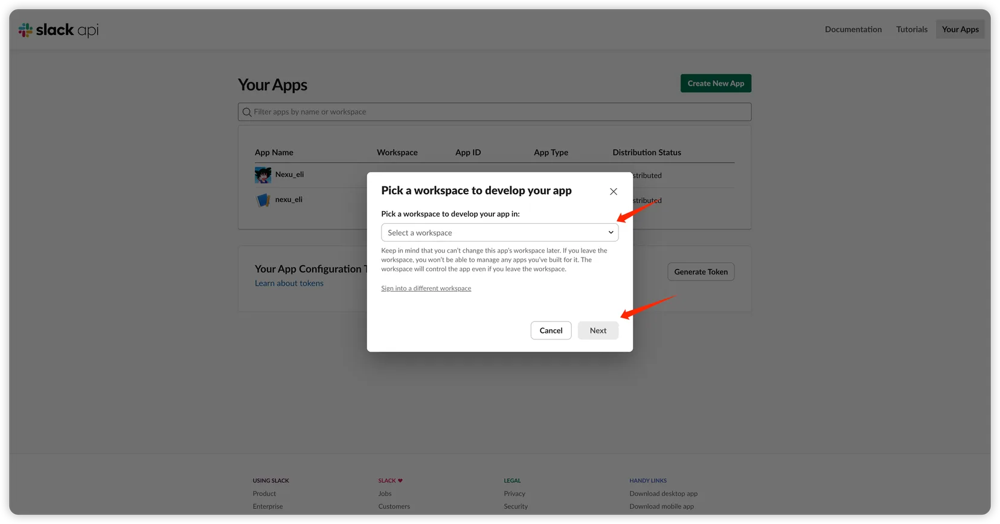
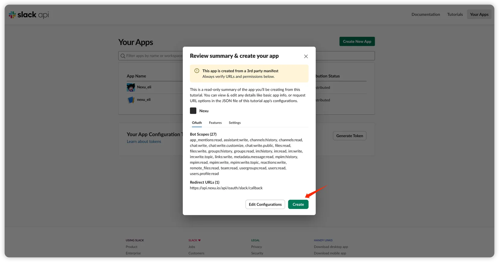
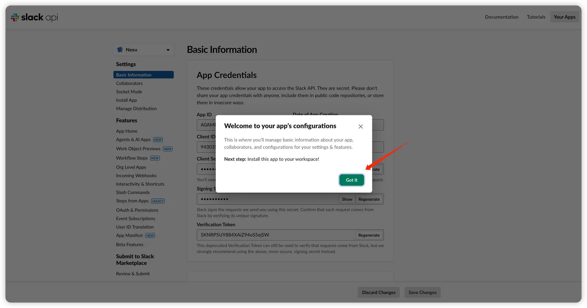
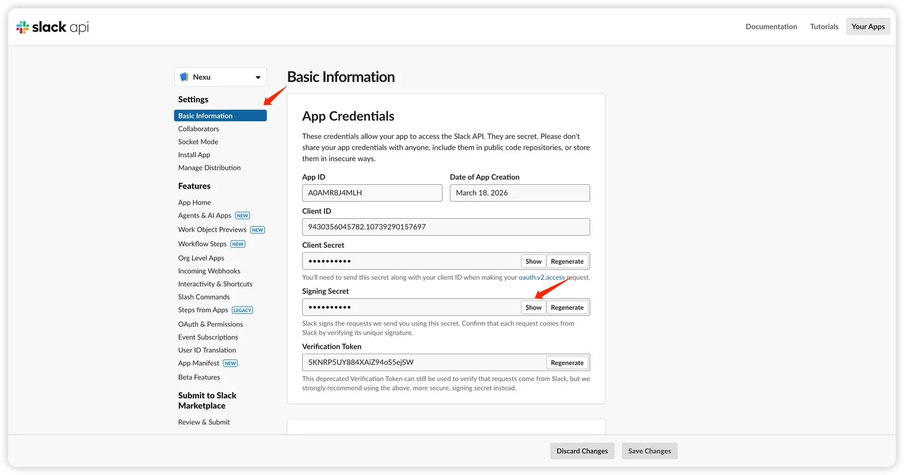
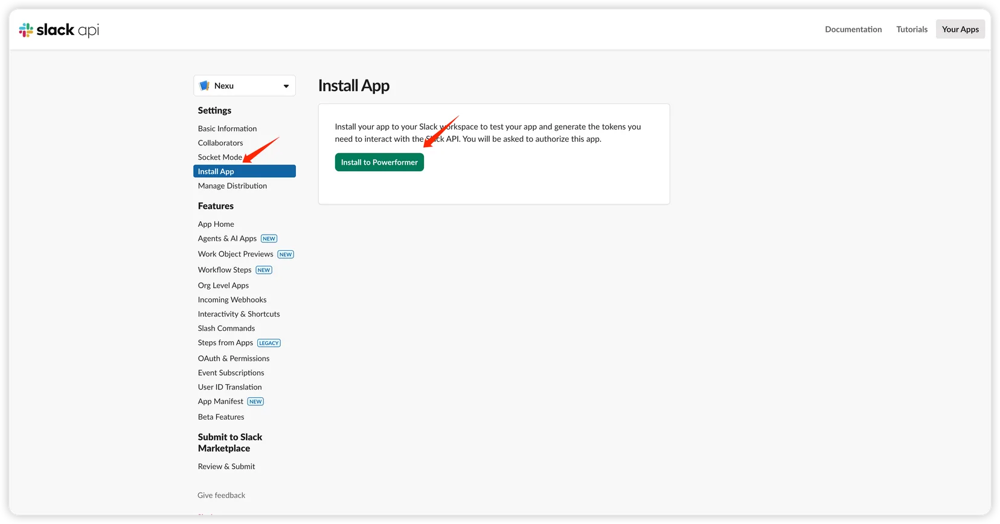
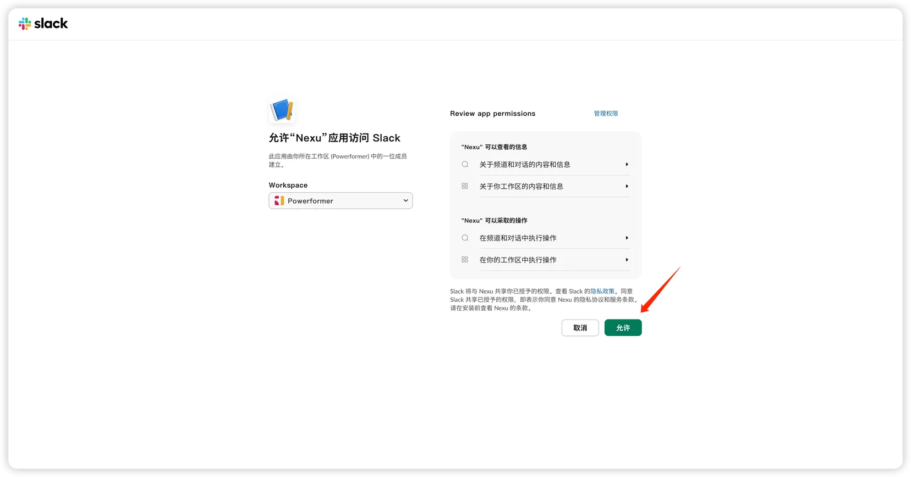
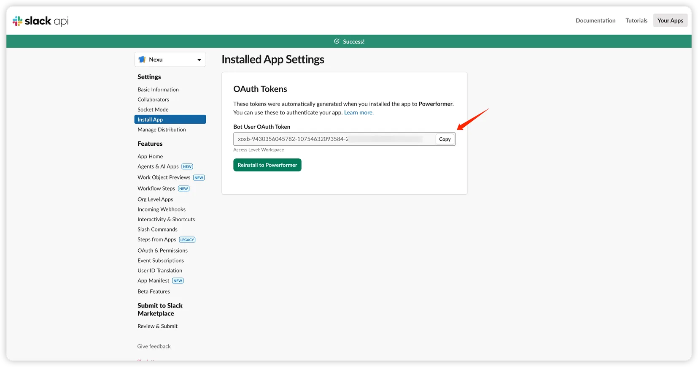
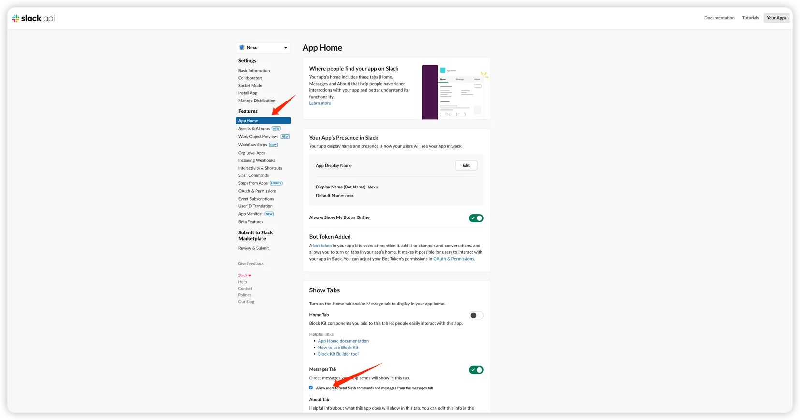
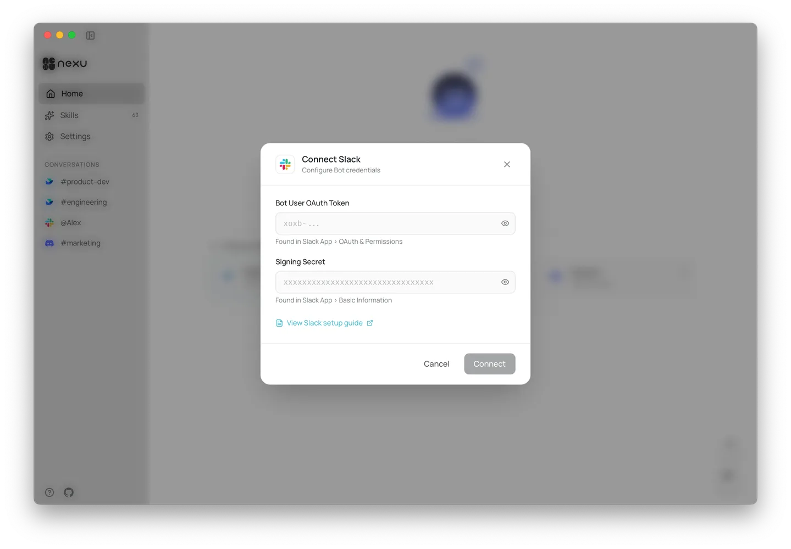
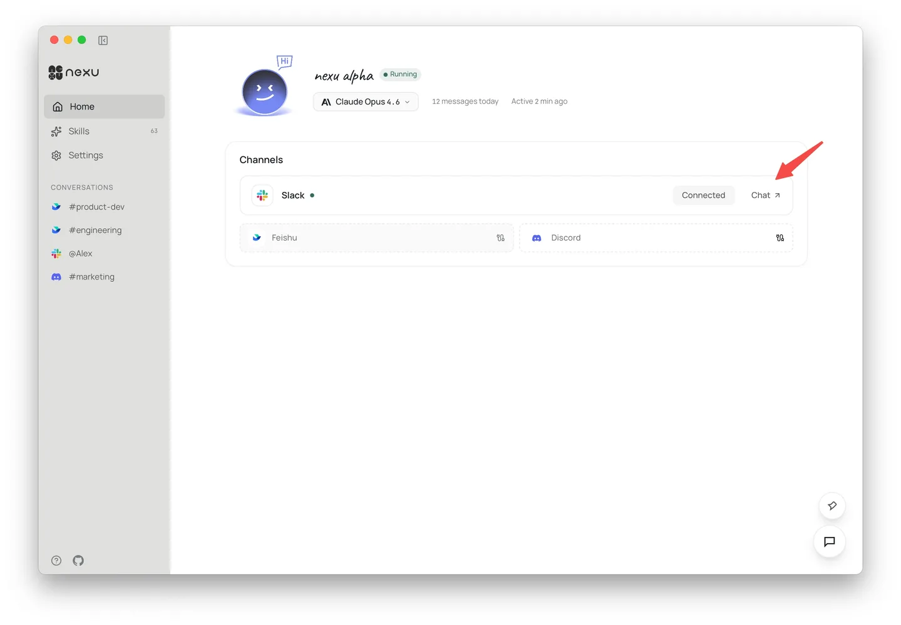

# Channel Setup: Set Up an AI Agent in Slack — One-Click App Creation

> Create a pre-configured Slack app with one link, paste two tokens, and your AI agent is live in every channel — under 5 minutes.

Only a Signing Secret and Bot Token needed to connect a Slack bot to nexu.

## Step 1: Create a Slack App

Click the manifest link in nexu's Slack setup guide. This opens Slack's app creation page with all 25+ permissions, event subscriptions, and URLs pre-configured.

Select your workspace, click "Next."

Confirm the pre-configured permissions and URL, click "Create."

Click "Got It."

## Step 2: Get Your Signing Secret

In the Slack app dashboard, go to "Basic Information" → "App Credentials." Copy the Signing Secret.

## Step 3: Get Your Bot Token

Go to "Install App", click "Install to Workspace."

Click "Allow" on the authorization page.

Copy the Bot User OAuth Token.

## Step 4: Enable Direct Messages

Go to "App Home" → "Show Tabs" → "Messages Tab", enable it, and check "Allow users to send Slash commands and messages from the messages tab."

## Step 5: Connect in nexu

Paste your Bot User OAuth Token and Signing Secret in nexu's Slack configuration, click "Connect."

After connecting, click "Chat" to jump to Slack and start talking to your AI agent.

## FAQ

**Do I need to configure permissions manually?** No. The manifest link pre-configures all scopes and event subscriptions.

**Do I need a public server?** No. nexu handles event receiving automatically.

