# Channel Setup: Add an AI Agent to Discord in 5 Minutes

> Create a Discord application, enable Message Content Intent, invite the bot — your AI agent is ready for your community.

All you need is an Application ID and a Bot Token to connect your Discord bot to nexu.

## Step 1: Create a Discord Application

1. Go to the [Discord Developer Portal](https://discord.com/developers/applications) and click "New Application".

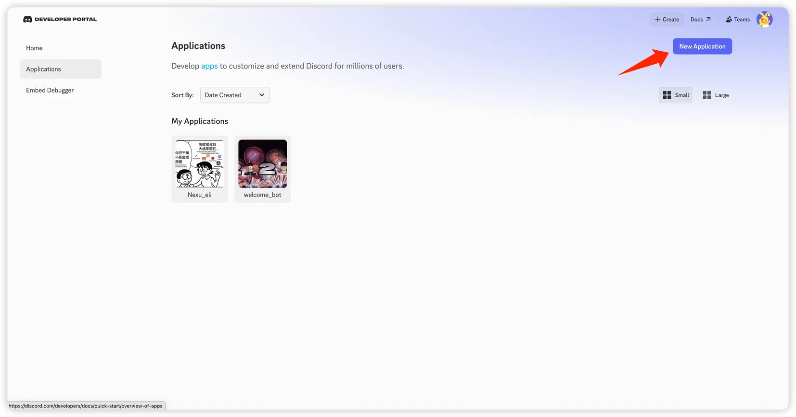

2. Enter the application name and click "Create".

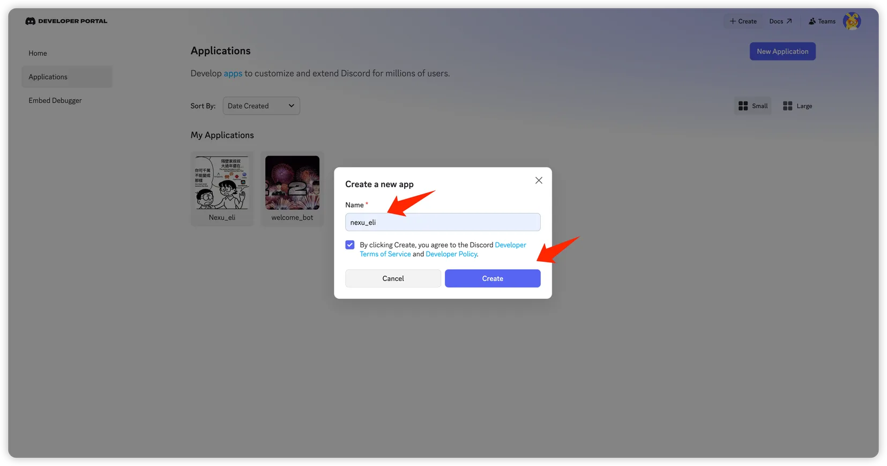

3. On the "General Information" page, copy and save the **Application ID**.

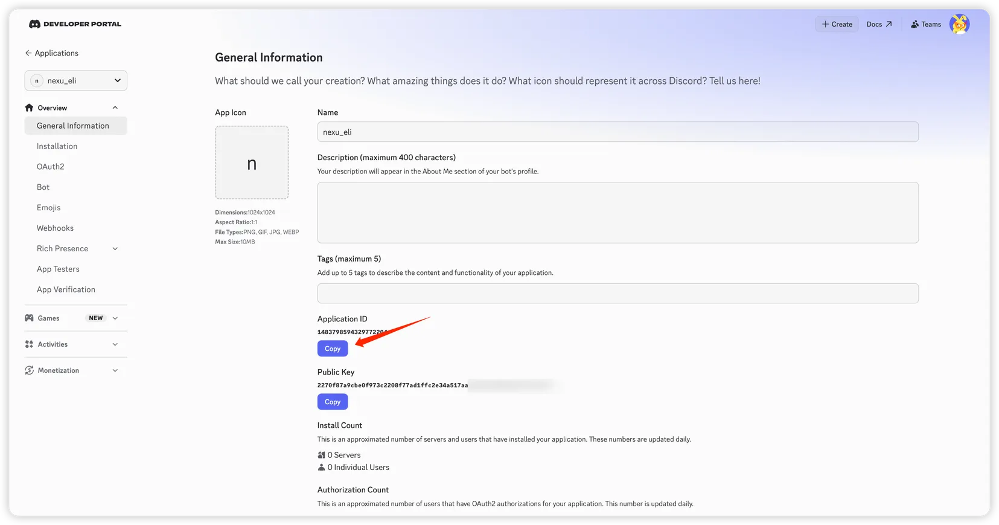

4. In the left menu, go to "Bot", click "Reset Token" to generate a Bot Token, and copy it.

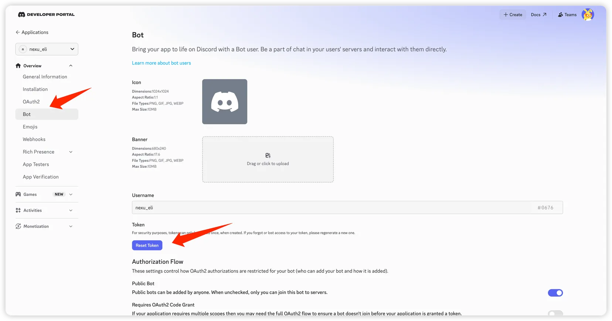

## Step 2: Add Credentials to nexu

Open the nexu client, enter the App ID and Bot Token in the Discord channel settings, and click "Connect".

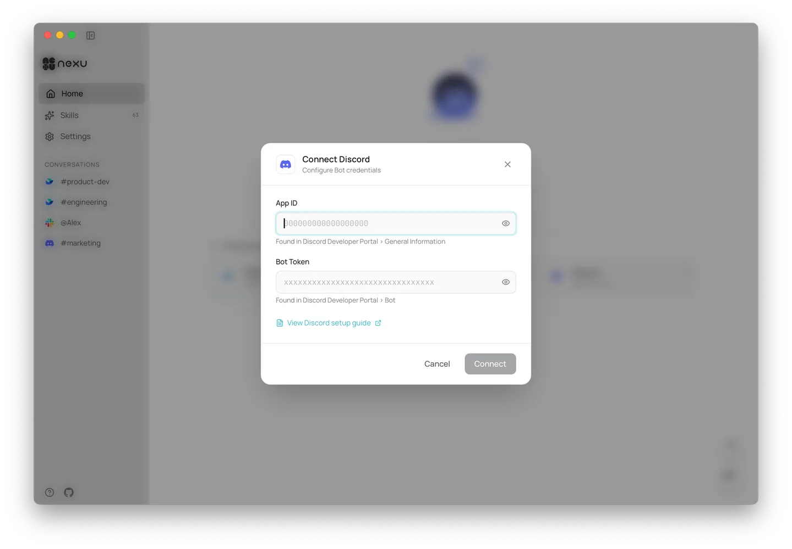

## Step 3: Configure Permissions and Invite the Bot

1. Back in the Discord Developer Portal, on the "Bot" page, enable the following Privileged Gateway Intents: **Message Content Intent**.

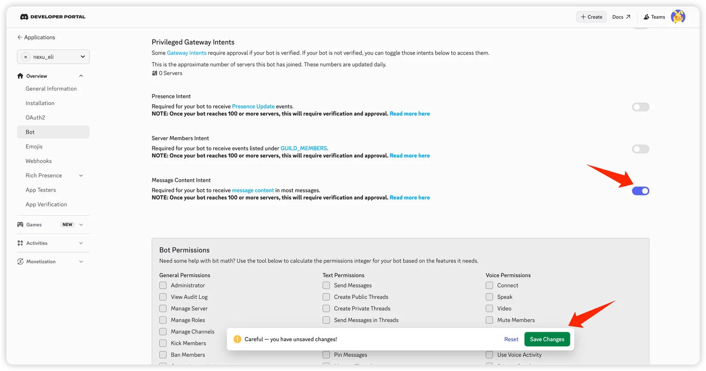

2. In the left menu, go to "OAuth2". Under Scopes, select `bot`. Under Bot Permissions, select `Administrator`.

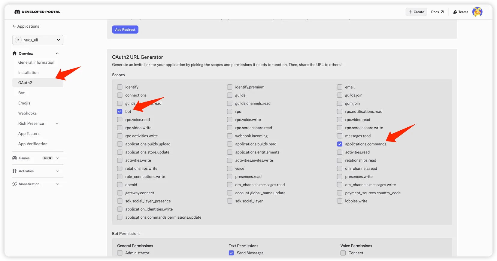

3. Copy the generated URL at the bottom of the page and open it in your browser.

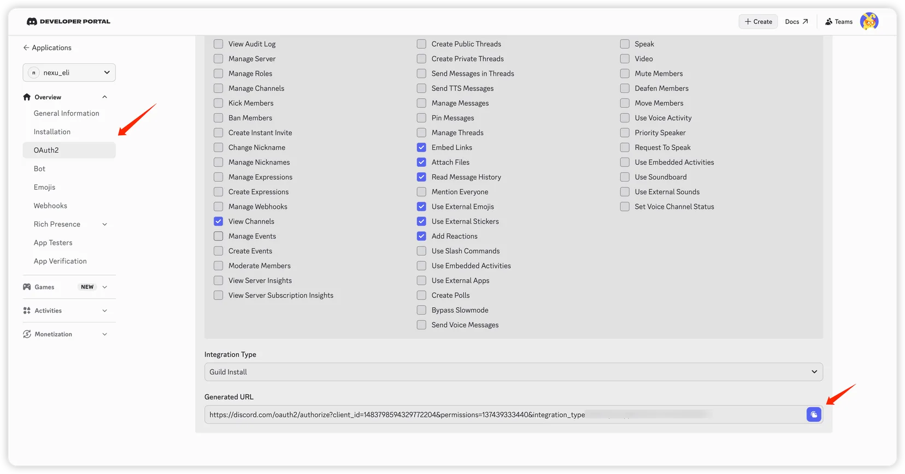

4. Select your server and click "Continue".

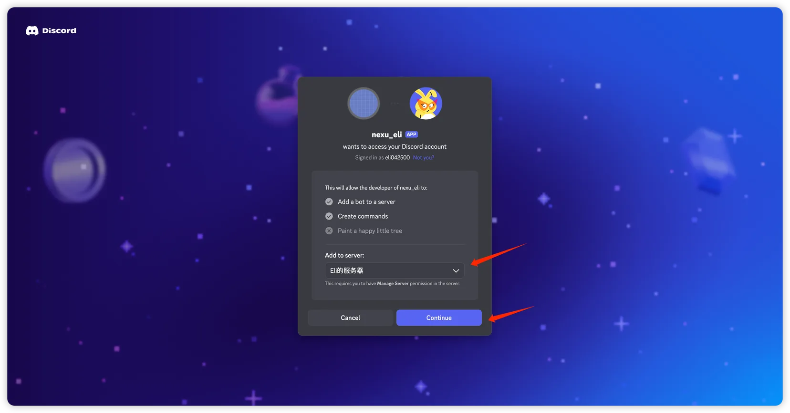

5. Confirm the permissions and click "Authorize" to add the bot.

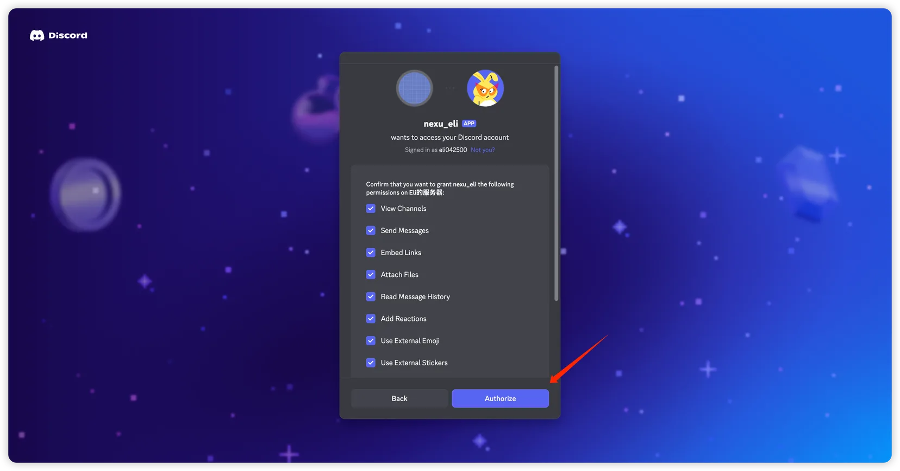

## Step 4: Test

Once connected, click "Chat" in the nexu client to jump to Discord and chat with your bot 🎉

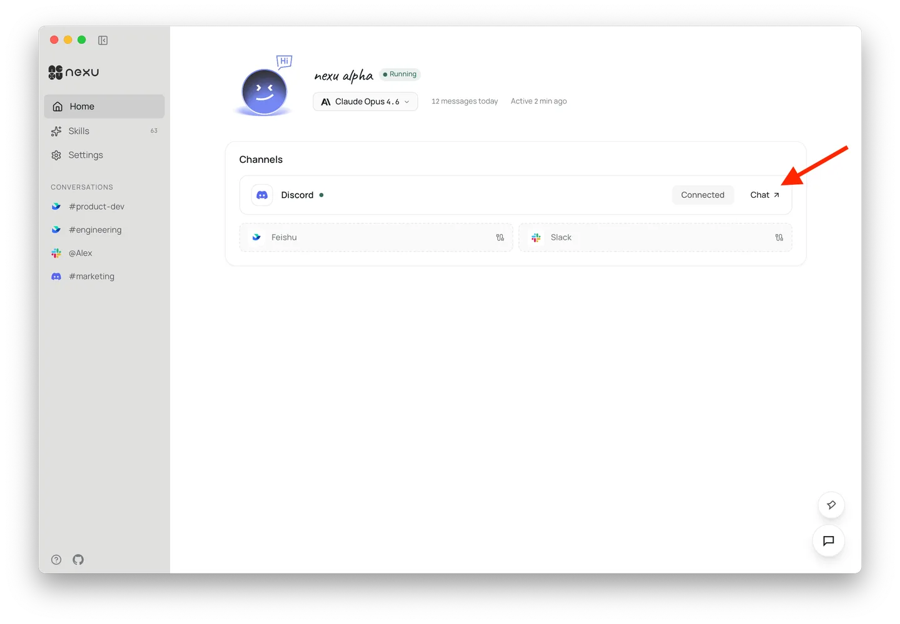

## FAQ

**Q: Do I need a public server?** No. nexu uses the Discord Gateway (WebSocket) — no public IP or callback URL required.

**Q: The bot doesn't reply to messages?** Make sure you've enabled Message Content Intent, otherwise the bot cannot read message content.

---

# 渠道配置：5 分钟把 AI Agent 加入 Discord 服务器

> 只需获取 Application ID 和 Bot Token，即可将 Discord 机器人接入 nexu。

只需获取 Application ID 和 Bot Token，即可将 Discord 机器人接入 nexu。

## 第一步：创建 Discord 应用

1. 打开 [Discord Developer Portal](https://discord.com/developers/applications)，点击「New Application」。

2. 填写应用名称，点击「Create」。

3. 进入「General Information」页面，复制保存：**Application ID**

4. 在左侧菜单进入「Bot」，点击「Reset Token」生成 Bot Token，复制保存：**Bot Token**

## 第二步：在 nexu 中填入凭证

打开 nexu 客户端，在 Discord 渠道配置中填入 App ID 和 Bot Token，点击「Connect」。

## 第三步：配置权限并邀请机器人

1. 回到 Discord Developer Portal，在「Bot」页面下方开启以下 Privileged Gateway Intents：**Message Content Intent**

2. 在左侧菜单进入「OAuth2」，在 Scopes 中勾选 `bot`，在下方 Bot Permissions 中勾选 `Administrator`。

3. 复制页面底部生成的 URL，在浏览器中打开。

4. 选择你的服务器，点击「Continue」。

5. 确认权限列表，点击「Authorize」，授权机器人加入。

## 第四步：测试

连接成功后，在 nexu 客户端点击「Chat」即可跳转到 Discord 与机器人对话 🎉

## 常见问题

**Q: 需要公网服务器吗？**不需要。nexu 使用 Discord Gateway（WebSocket），无需公网 IP 或回调地址。

**Q: 机器人没有回复消息？**请确认已开启 Message Content Intent，否则机器人无法读取消息内容。

