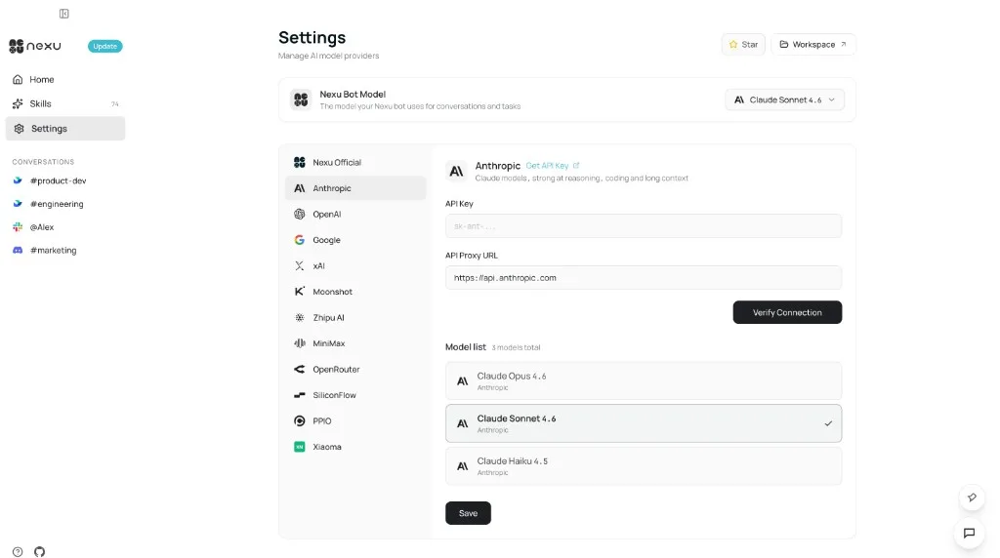
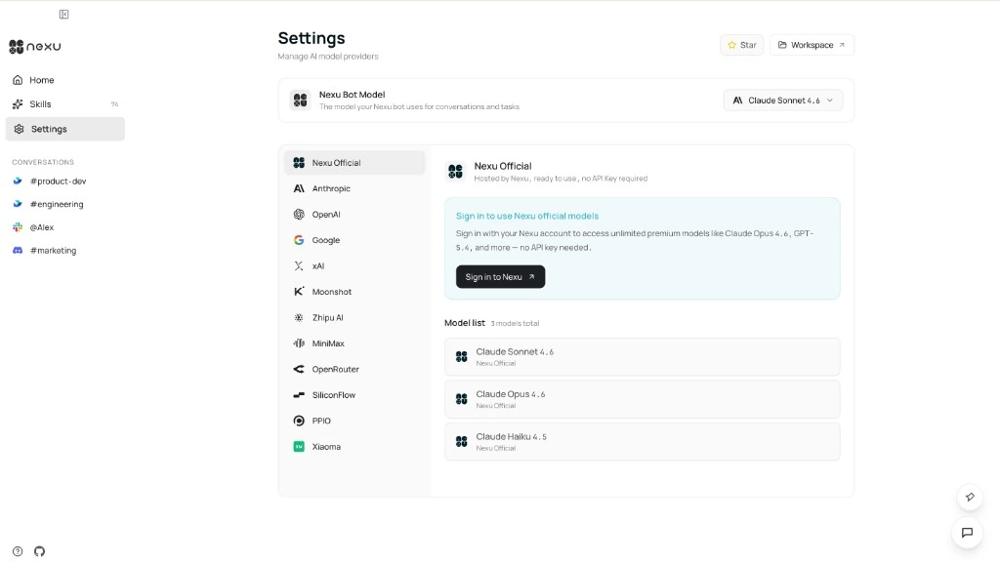
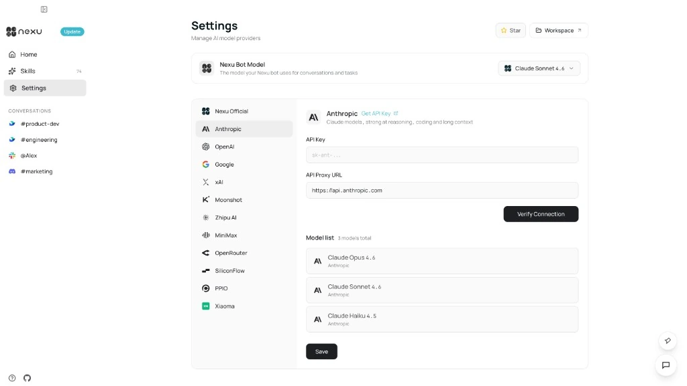
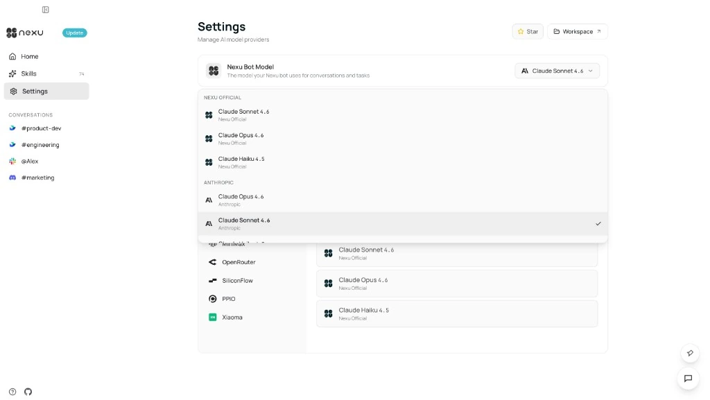

# Model Setup: Claude, GPT & Gemini in One Client

> Free hosted models or bring your own API key — switch between Claude, GPT, Gemini, and more with one click, no workflow disruption.

nexu supports two model access methods: Nexu Official (hosted, login to use) and BYOK (bring your own API Key). Both can be switched at any time without affecting existing conversations or channel connections.

## Step 1: Open Settings

Click "Settings" in the left navigation bar to enter the AI Model Providers page.

## Option A — Nexu Official (Recommended)

Select "Nexu Official" in the provider list, click "Sign in to Nexu." After logging in, Claude Sonnet 4.6, Claude Opus 4.6, Claude Haiku 4.5 and more are immediately available — no API key configuration needed.

## Option B — Bring Your Own Key (BYOK)

Select Anthropic, OpenAI, Google AI, or another provider. Paste your API key, optionally modify the API Proxy URL, click "Save." nexu auto-validates and loads available models. Your key stays on your local machine — it never touches nexu's servers.

## Step 3: Select Active Model

In the "Nexu Bot Model" dropdown at the top, select the model for your agent. Switch across providers anytime — mid-project — without affecting existing conversations.

## Supported Providers

Anthropic (Claude, sk-ant-...) · OpenAI (GPT, sk-...) · Google AI (Gemini, AIza...) · xAI (Grok, xai-...) · Custom (any OpenAI-compatible endpoint for self-hosted models or proxies).

## Best Practices

Use minimum-privilege API keys. Never expose keys in screenshots, tickets, or git commits. Click "Verify Connection" before saving a BYOK provider. Use Custom provider type for proxies, self-hosted gateways, or OpenAI-compatible inference services.

## FAQ

**Which method should I start with?** Nexu Official — log in and use high-quality models instantly, zero configuration.

**Can I configure multiple BYOK providers?** Yes. Anthropic, OpenAI, Google AI etc. can be configured independently and switched via the top model dropdown.

**Does my API key get uploaded to nexu servers?** No. API keys are stored only on your local device.

---

# 模型配置：Claude、GPT、Gemini 一个客户端搞定

> nexu 支持两种模型接入方式：Nexu Official（登录即用）和 BYOK（自带 API Key）。两种方式可随时切换。

nexu 支持两种模型接入方式：Nexu Official（托管模型，登录即用）和 BYOK（自带 API Key）。两种方式可随时切换，不影响已有对话和渠道连接。

## 第一步：打开 Settings

在 nexu 客户端左侧导航栏点击 Settings，进入 AI Model Providers 配置页面。

## 方式 A — Nexu Official（推荐）

在左侧供应商列表中选择 Nexu Official，点击 Sign in to Nexu 完成账号登录。登录后无需配置任何 API Key，Claude Sonnet 4.6、Claude Opus 4.6、Claude Haiku 4.5 等模型立即可用。

## 方式 B — 自带密钥（BYOK）

在左侧供应商列表中选择 Anthropic、OpenAI、Google AI 或其他供应商：在 API Key 字段粘贴你的密钥；如需自定义代理，修改 API Proxy URL；点击 Save，nexu 会自动验证密钥并加载可用模型列表。

## 第三步：选择当前模型

连接成功后，在 Settings 页面顶部 Nexu Bot Model 下拉菜单中选择 Agent 使用的模型，支持跨供应商随时切换。

## 支持的供应商

Anthropic (sk-ant-...) · OpenAI (sk-...) · Google AI (AIza...) · xAI (xai-...) · Custom（你的 OpenAI 兼容端点）。

## 使用建议

使用最小权限的 API Key，避免不必要的访问范围。不要在截图、工单或 Git 提交记录中暴露密钥。添加 BYOK 供应商时，先点击 Verify Connection 验证连通性，确认无误后再保存。需要代理、自建网关或 OpenAI 兼容推理服务时，使用 Custom 供应商类型。

## 常见问题

**刚开始用哪种方式比较好？**推荐 Nexu Official——登录账号后无需任何配置，即可使用高质量模型。

**可以同时配置多个 BYOK 供应商吗？**可以。Anthropic、OpenAI、Google AI 等可以独立配置，随时通过顶部 Nexu Bot Model 下拉菜单切换。

**API Key 会被上传到 nexu 服务器吗？**不会。API Key 仅存储在你的本地设备上，不会传输至 nexu 服务器。

