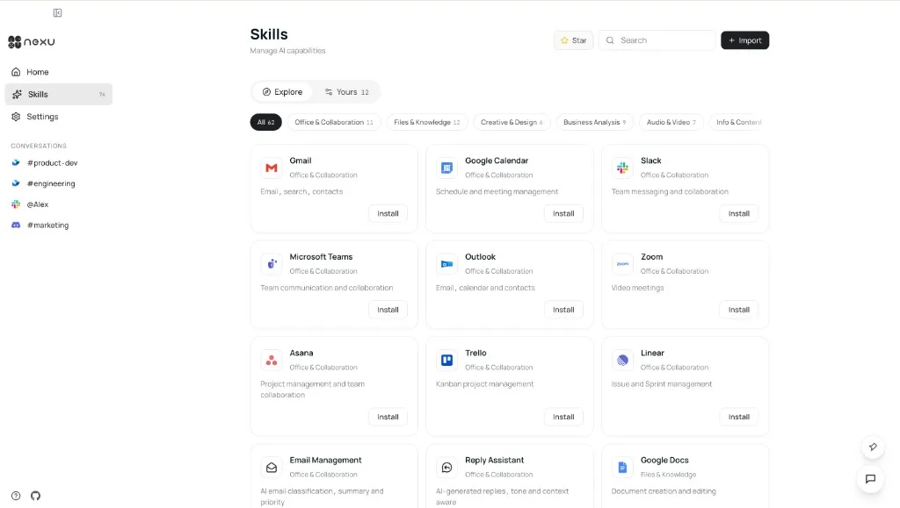
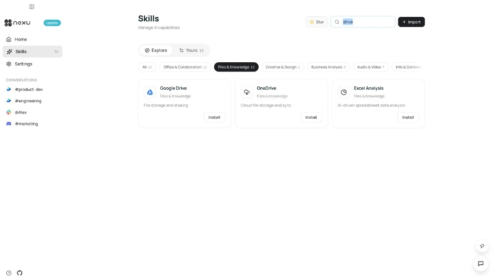
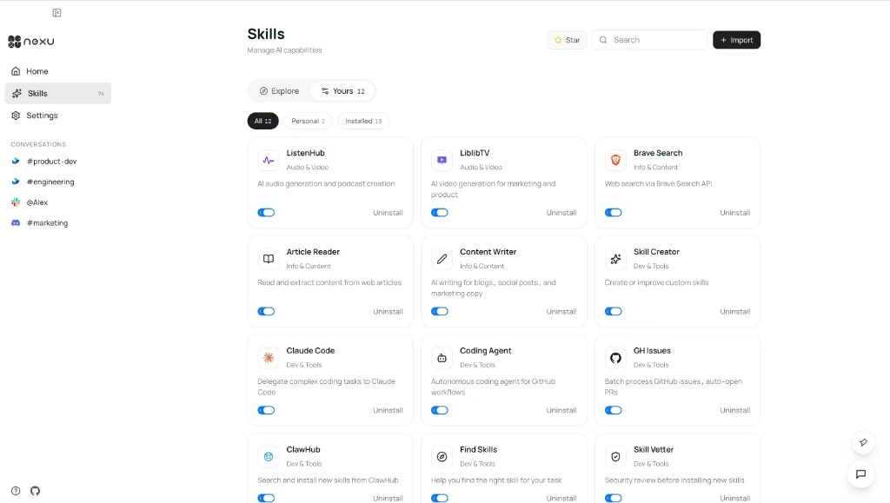
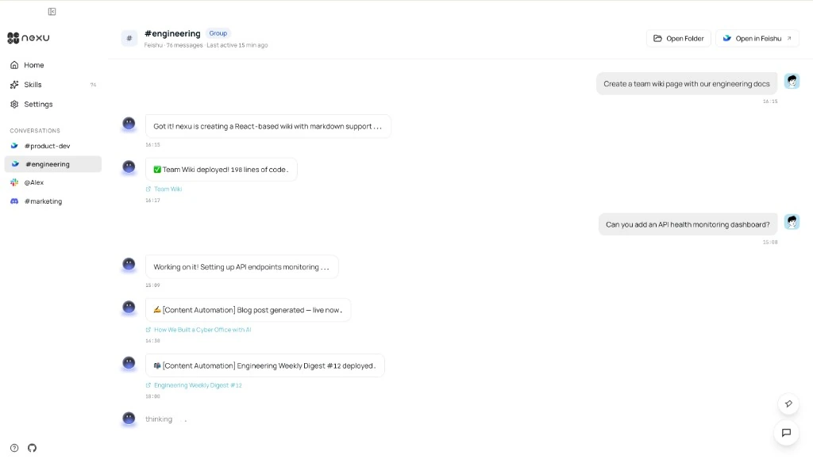

# Skill Setup: Turn Your Chatbot Into a Specialist

> Browse, one-click install, start using — Skills give your AI agent specialized capabilities from document generation to spreadsheet operations, no restart needed.

Skills extend your agent's capabilities — from web search and document generation to Feishu Bitable operations and third-party API calls. Installing a skill takes seconds.

## Step 1: Open the Skills Page

Click "Skills" in the left navigation bar to enter the Skill center. The "Explore" tab shows all available public skills, filterable by category (Office & Collaboration, Files & Knowledge, Creative & Design, Business Analysis, Audio & Video, etc.) or keyword search.

## Step 2: Find and Install a Skill

Browse or search for your target skill. Click "Install" on the card. Skills support hot-loading — they activate immediately without restarting your agent.

## Step 3: Verify Installation

Switch to the "Yours" tab to see installed skills. Each has a toggle to enable or disable without uninstalling.

## Step 4: Use Skills in Conversation

After installation, just describe what you need in your channel conversation. Your agent automatically selects the right skill to complete the task.

## FAQ

**Do I need to restart after installing?** No. Skills support hot-loading — the agent recognizes and enables new skills immediately.

**Can I install custom skills?** Yes. nexu supports local custom skill development. See the developer docs for details.

**How to uninstall?** Go to the "Yours" tab and click "Uninstall" next to the skill.

---

# 技能安装：把聊天机器人变成专家

> 技能扩展了 Agent 的能力边界——从网络搜索、文档生成，到飞书多维表格操作、第三方 API 调用，应有尽有。安装只需几秒钟。

技能扩展了 Agent 的能力边界——从网络搜索、文档生成，到飞书多维表格操作、第三方 API 调用，应有尽有。安装一个技能只需几秒钟。

## 第一步：打开技能页面

在 nexu 客户端左侧导航栏点击 Skills，进入技能中心。Explore 标签展示所有可安装的公共技能，支持按分类筛选（Office & Collaboration、Files & Knowledge、Creative & Design、Business Analysis、Audio & Video 等）或直接搜索关键词。

## 第二步：找到并安装技能

浏览或搜索目标技能，点击卡片上的 Install 按钮。技能支持热加载，安装后无需重启 Agent 即可立即生效。

## 第三步：确认安装

切换到 Yours 标签，查看已安装的技能列表，并可通过开关随时启用或禁用单个技能。

## 第四步：在对话中使用

技能安装后，直接在渠道对话中描述需求即可，Agent 会自动选择合适的技能完成任务。

## 常见问题

**安装技能后需要重启 Agent 吗？**不需要。技能支持热加载，Agent 会立即识别并启用新安装的技能。

**可以安装目录以外的技能吗？**可以。nexu 支持本地自定义技能开发，满足个性化需求。详见开发者文档。

**如何卸载技能？**进入 Yours 标签，点击对应技能旁的 Uninstall 即可。

